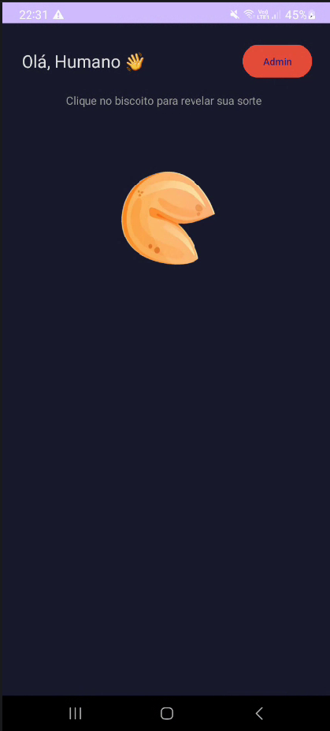
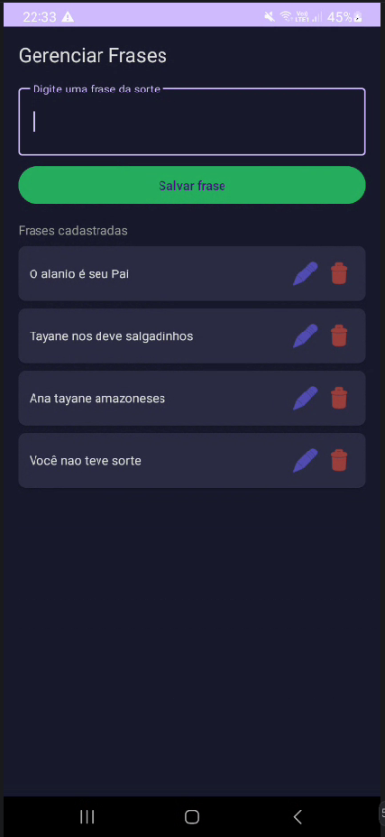

# 🥠 Biscoito da Sorte — App Android

> Aplicativo mobile de biscoito da sorte desenvolvido com Java nativo para Android, utilizando banco de dados local SQLite para armazenamento e gerenciamento de frases motivacionais.

---

## 📋 Índice

- [Sobre o Projeto](#-sobre-o-projeto)
- [Tecnologias Utilizadas](#-tecnologias-utilizadas)
- [Funcionalidades](#-funcionalidades)
- [Estrutura de Pastas](#-estrutura-de-pastas)
- [Como Executar](#-como-executar)
- [Telas do Aplicativo](#-telas-do-aplicativo)

---

## 📖 Sobre o Projeto

O **Biscoito da Sorte** é um aplicativo Android desenvolvido como projeto acadêmico com o objetivo de praticar os conceitos fundamentais do desenvolvimento mobile nativo com Java, incluindo persistência de dados local, navegação entre telas e manipulação de listas dinâmicas.

A ideia é simples e intuitiva: o usuário visualiza um biscoito da sorte na tela e, ao clicar nele, recebe uma frase motivacional aleatória armazenada no banco de dados do dispositivo. O aplicativo também conta com uma área administrativa onde é possível cadastrar, editar e remover frases, tornando o conteúdo totalmente personalizável.

### 🎯 Objetivo Acadêmico

Este projeto foi desenvolvido com foco em aplicar na prática os seguintes conceitos:

- Desenvolvimento Android nativo com **Java**
- Persistência de dados com **SQLite** via `SQLiteOpenHelper`
- Padrão de projeto **MVC** (Model-View-Controller)
- Navegação entre `Activities`
- Operações **CRUD** completas (Create, Read, Update, Delete)

---

## 🛠 Tecnologias Utilizadas

| Tecnologia | Versão | Descrição |
|---|---|---|
| Java | 11+ | Linguagem principal de desenvolvimento |
| Android SDK | API 24+ (Android 7.0) | Plataforma de desenvolvimento mobile |
| SQLite | Nativo Android | Banco de dados local do dispositivo |
| RecyclerView | 1.3.2 | Listagem dinâmica e eficiente de frases |
| Material Design | 1.11.0 | Componentes visuais (TextInputLayout, Cards) |
| CardView | AndroidX | Componente de cards para exibição de resultados |
| Android Studio | Hedgehog+ | IDE de desenvolvimento |

---

## Funcionalidades

### Tela Principal — Usuário
-  Mensagem de boas-vindas ao usuário
-  Biscoito da sorte clicável que revela uma frase aleatória
-  Botão para sortear uma nova frase
-  Acesso à área administrativa via botão "Admin"

### Tela Administrativa
-  Cadastro de novas frases da sorte
-  Listagem de todas as frases cadastradas
-  Edição de frases existentes via dialog
-  Remoção de frases com confirmação

---

## 📁 Estrutura de Pastas

```
AppMeuBiscoito/
│
├── app/src/main/
│   │
│   ├── java/com/example/appmeubiscoito/
│   │   ├── Frase.java           → Modelo de dados da frase (id + texto)
│   │   ├── DatabaseHelper.java  → Gerencia o SQLite e todas as operações CRUD
│   │   ├── MainActivity.java    → Tela principal: biscoito e exibição de frases
│   │   ├── AdminActivity.java   → Tela admin: cadastro e listagem de frases
│   │   └── FraseAdapter.java    → Adapter do RecyclerView com editar e remover
│   │
│   ├── res/
│   │   ├── drawable/            → Imagens do biscoito (fechado e aberto)
│   │   └── layout/
│   │       ├── activity_main.xml   → Layout da tela principal
│   │       ├── activity_admin.xml  → Layout da tela administrativa
│   │       └── item_frase.xml      → Layout de cada item da lista
│   │
│   └── AndroidManifest.xml     → Registro das Activities do app
│
├── docs/
│   ├── tela_principal.png      → Print da tela inicial
│   └── tela_admin.png          → Print da tela administrativa
│
└── README.md
```

---

## 🚀 Como Executar

### Pré-requisitos

- Android Studio (versão Hedgehog ou superior)
- JDK 11 ou superior
- Dispositivo Android com API 24+ ou Emulador configurado

### Passos

```bash
# 1. Clone o repositório
git clone https://github.com/seu-usuario/AppMeuBiscoito.git

# 2. Abra no Android Studio
# File → Open → selecione a pasta do projeto

# 3. Aguarde o Gradle sincronizar as dependências

# 4. Selecione o dispositivo e clique em ▶ Run
```

> **Nota:** No primeiro acesso, o banco de dados é criado automaticamente com frases padrão pré-cadastradas.

---

## 📱 Telas do Aplicativo

### Tela Principal

<p align="center">
  
</p>

O usuário é recebido com uma saudação e visualiza o biscoito da sorte no centro da tela. Ao clicar nele, uma frase aleatória é sorteada do banco de dados e exibida em um card. Um botão de recarregar permite sortear uma nova frase sem precisar reiniciar o app.

---

### Tela Administrativa

<p align="center">
  
</p>

A tela administrativa permite gerenciar o banco de frases completo. O administrador pode cadastrar novas frases pelo campo de texto, visualizar todas as frases salvas em uma lista e, para cada item, editar o conteúdo ou remover permanentemente com um toque.

---

## 🗄 Banco de Dados

### Tabela `frases`

| Coluna | Tipo | Descrição |
|---|---|---|
| `id` | INTEGER (PK, AUTOINCREMENT) | Identificador único da frase |
| `texto` | TEXT (NOT NULL) | Conteúdo da frase da sorte |

---

## 👨‍💻 Autor

Desenvolvido como projeto acadêmico para estudo de desenvolvimento Android nativo com Java e SQLite.